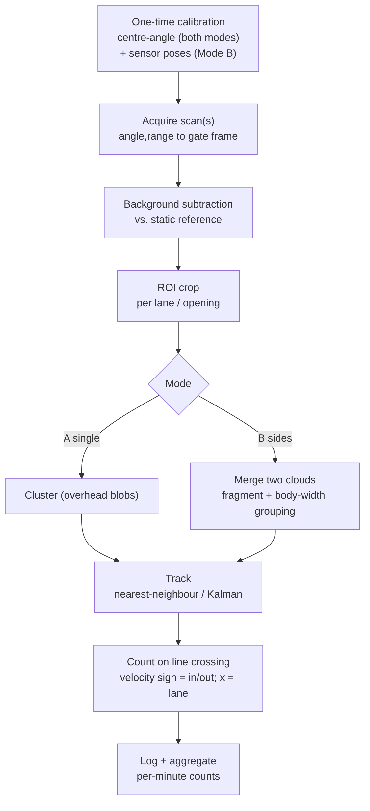
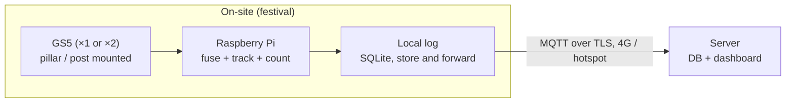

# 2D LiDAR Entrance People-Counting — Festival Pilot Plan (GS5)

A bidirectional people counter for a festival entrance, built on the **YDLIDAR GS5** 2D line-scanning LiDAR with **two interchangeable operating modes**:

- **Mode A — single GS5, centre / overhead.** One sensor over a narrow lane. Cheapest, fastest to deploy.
- **Mode B — two GS5s, sides (fused).** One sensor per side post, point clouds merged into a shared frame for wider coverage and reduced occlusion.

All counting runs locally on a Raspberry Pi; counts are logged on-device and pushed to a server when the network allows. The approach is privacy-preserving by design — LiDAR captures no images, and raw scans never leave the device.

> **Deployment context:** temporary, **~1 week** at a festival. **Budget: ~3000 DKK** (≈ €400 / $440). This is a field pilot, not a permanent install, so priorities are fast setup, daylight tolerance, power continuity, and resilience to flaky festival networks — not multi-year hardware longevity.

> **⚠️ Headline risk (read first).** The GS5's effective range is only **0.07–1.0 m**, and it is a **triangulation** sensor (not time-of-flight). Both facts cut against an outdoor entrance: the 1 m ceiling forces low/tight mounting and caps lane width, and triangulation is historically weaker in direct sun (the vendor markets the GS5 as sunlight-resistant, but that must be **validated on-site**). The GS5 is chosen here for cost, size, solid-state durability, and the two-mode flexibility — but coverage and daylight performance are the make-or-break unknowns. An RPLIDAR C1 (12 m TOF) is kept as the documented fallback in §12 if validation fails.

---

## 1. Summary of decisions

- **Sensor:** YDLIDAR GS5 — solid-state (no moving parts), 80° FOV, 0.54° resolution, 0.07–1.0 m range, eye-safe Class I, ~$50.
- **Modes:** **A** = single sensor centre/overhead over one lane; **B** = two sensors on the side posts, fused. Same Raspberry Pi, same pipeline core, different geometry and calibration.
- **Edge compute:** Raspberry Pi 5 (1–2 GB) — all clustering, tracking, and counting on-device.
- **Data:** counts logged locally (SQLite/CSV) and pushed over MQTT when a network is available, with store-and-forward so nothing is lost offline.
- **Budget:** Mode A lands around **~1,800 DKK**; Mode B around **~2,250 DKK** (second sensor). Both leave contingency margin.
- **Software:** versioned reference code already built — `gs5_overhead_counter.py` (Mode A core), `gs5_gate_fusion.py` (Mode B core), plus the live runners. Under git history (v1.0.0 → v3.0.0).

---

## 2. Operating modes & physical setup

Both modes scan a 2D plane and turn it into a per-person count. The key design choice for an **entrance** is direction (in vs out): a single momentary cross-section can't resolve travel direction, so the scan must capture motion. The two modes handle this differently (below).

### Mode A — single GS5, centre / overhead

One sensor mounted over the lane. Two orientations:

- **Fan across the lane** → clean per-person clusters, separates side-by-side people, but gives **no travel direction** from one line. Use only where the lane is physically one-way.
- **Fan along the lane** → a person's position advances along the fan frame-to-frame, so velocity gives **direction** (in/out) at a virtual counting line. Trade-off: side-by-side people in the lane can merge. Best for a **single-file, ~1-lane chokepoint**.

```
        GS5 (overhead, ~2.1–2.3 m)
              │  80° fan
        ┌─────┴─────┐
        ▼           ▼        ← swath ≈ 1.68 × (H − head height) ≈ 0.85–1.2 m
   ───walkway──────────────►  (fan ALONG lane for direction)
```

**Mount-height window (critical).** Because the GS5 only sees 0.07–1.0 m, the sensor must sit close to people's heads. To image heads from `P_min` to `P_max`:

> `P_max + 0.07 m ≤ H ≤ P_min + 1.00 m`

e.g. to catch heads 1.4–2.0 m, mount at **H ≈ 2.1–2.3 m**. Anyone shorter than `H − 1.0 m` (small children) is **out of range and missed** — a real festival caveat.

### Mode B — two GS5s, sides (fused)

One sensor on each side post, scanning **horizontally** across the entrance at ~torso height, fans aimed to overlap. Each sensor covers its **near ~1 m**; the two clouds are transformed into one shared "gate frame" and merged. Tracking 2D positions over time gives **direction + which lane**.

```
   left post                         right post
   [GS5 A]●→        overlap        ←●[GS5 B]
         \____  region of interest ____/
              (≤ ~2 m wide total; CENTRE is the
               most range-marginal zone)
   ───────────── entrance ─────────────►
```

- **Coverage caps at ~2 m wide.** At a 2 m gap the centre is ~1 m from each sensor — right at the range limit and the **weakest** zone. Beyond ~2 m there's a dead band in the middle.
- **Fusion beats two independent counters:** a person in the overlap is seen by both; merging into one frame first means the overlap *densifies the same cluster* instead of being double-counted.
- **Silhouette caveat:** a side-on view sees a person as their outline (two vertical-ish edges). The clusterer first splits into fine fragments, then groups fragments spanning ≤ a body-width into one body (`max_body_width_m`, default 0.48 m). This is the parameter that does the real work and the main thing to tune on-site.

### Shared setup notes

- **Mount rigidly but without drilling** — clamp/strap to pillar/posts. Sway shifts the static background and creates false detections; verify rigidity before calibrating.
- **Define an ROI** so the crowd beyond and the structure itself are ignored.
- **Calibrate on-site** (see §6): per-sensor centre-angle for both modes, plus per-sensor pose (extrinsics) for Mode B.
- **Keep the optical window clean and in clear air** — no plastic shield in front of the lens.

---

## 3. Sensor selection

The 3000 DKK budget rules out production-grade sensors (Hokuyo/SICK run 7,000–14,000 DKK). Within the budget tier the GS5 was chosen for its cost, tiny size, solid-state reliability, and two-mode flexibility. Its specs and trade-offs:

| Spec | GS5 | Implication |
|------|-----|-------------|
| Range | **0.07–1.0 m** | The binding constraint. Caps lane width and forces close mounting; floor is out of range (handy: empty = no returns). |
| FOV / resolution | 80° / 0.54° | ~0.85–1.2 m swath at head height; ample point density for one lane. |
| Type | **Triangulation** | Daylight risk (vendor claims sunlight-resistance; **validate outdoors**). Short range helps signal strength in sun. |
| Build | Solid-state, no moving parts, eye-safe Class I | Durable, quiet, no spinning head to weatherproof. |
| Interface | USB-C adapter board (incl.), 921600 baud | Enumerates as `/dev/ttyUSB*`; Mode B needs two USB ports. |
| Price | ~$50 (kit incl. adapter + cable) | ~450 DKK landed each (VAT + shipping). |

**Comparison / fallback (RPLIDAR C1, TOF, 12 m, ~600 DKK):** genuinely better suited to a wide, daylit entrance — longer range and TOF daylight tolerance. It's retained as the **§12 fallback** if GS5 on-site validation (coverage and/or daylight) fails. The GS5 plan is the primary because of cost and the two-mode design the team wants to trial.

Prices are list (USD) converted at ~6.45 DKK/USD; add Danish VAT (25%) and shipping for landed cost.

---

## 4. Edge compute (Raspberry Pi)

A Raspberry Pi is comfortably enough. 2D LiDAR counting is light work: a GS5 frame is at most a few hundred points, and after background subtraction and ROI cropping only the people remain — usually tens of points, not thousands. Mode B simply merges two such frames.

Per-frame cost is dominated by clustering on that small set — on the order of ~1–2 ms against a ~25–100 ms budget. **CPU is not the constraint.** The **Raspberry Pi 5 1 GB (~$45) or 2 GB (~$55)** is ideal for a headless counter. (Pi prices rose in early 2026 due to a memory shortage; low-RAM boards were largely spared.)

For a 1-week run, SD-wear is moot — a good-quality microSD is fine. What matters:

- **Write it vectorized.** numpy on whole arrays plus a real clustering routine. The provided reference code is already numpy-vectorized; avoid per-point Python loops.
- **Two USB devices in Mode B.** Both GS5s plug into the Pi; read the latest frame from each per loop (they're not hardware-synced — see §9 time-sync note).
- **Steady power and I/O.** USB LiDAR draws real current — use a quality PSU; brownouts show up as dropped scans (see §5).

---

## 5. Festival deployment specifics

These decide whether the pilot survives the week.

- **Daylight (elevated risk with GS5).** Triangulation + outdoors is the headline unknown. Shelter the entrance from direct low sun, keep the lens clean, and **run an outdoor daylight test before the event** (see §11). If returns drop out in sun, fall back to the C1 (§12).
- **Power.** Plan for continuous mains at the entrance. Put a **power bank or small mini-UPS inline** so brief outages/generator switchovers don't reboot the Pi mid-count. A full week on battery alone isn't realistic (~10–15 W continuous; a hair more in Mode B with two sensors).
- **Weather.** The GS5 isn't IP-rated but is **solid-state with no spinning head**, which simplifies sheltering — house the Pi + sensor(s) under the canopy/overhang and in a cheap IP-rated enclosure, leaving the optical window in clear air with line of sight.
- **Network & data.** Don't depend on festival Wi-Fi. **Log locally first** (SQLite/CSV), push opportunistically over a **4G dongle or phone hotspot**, with store-and-forward so a dropout never loses data. A live dashboard is a bonus, not a dependency.
- **Mounting.** Mode A needs an overhead point ~2.1–2.3 m over the lane (gantry/arch/cross-bar). Mode B clamps to the two side posts. Verify rigidity before calibrating.
- **Privacy / GDPR.** LiDAR captures no images; only aggregate counts are stored, so no personal data is processed — a genuine advantage for a public event. Confirm signage/permissions with organisers; there's no PII to manage.

---

## 6. Processing pipeline



1. **Calibrate (once on-site).** For each sensor, find the SDK angle that points straight at the reference direction (`--calibrate` in the runner). For Mode B, also measure each sensor's pose `(u0, v0, boresight)` in the gate frame — this extrinsic calibration is what makes fusion line up (errors of >~1 cm / few degrees cause ghosting).
2. **Acquire.** Read each scan; convert `(angle, range)` into the shared frame (precompute sin/cos — angles are fixed).
3. **Background subtraction.** Maintain a reference of the empty entrance and subtract; update slowly for drift. (Helpful even though the floor is out of range, to remove fixed structure within 1 m.)
4. **ROI crop.** Keep only points inside each lane/opening polygon.
5. **Cluster.** Mode A: blob clustering + size filter. Mode B: merge both clouds, split into fine fragments, then group fragments spanning ≤ `max_body_width_m` into one body; gate on point count and vertical spread.
6. **Track.** Associate clusters across frames (nearest-neighbour; optional constant-velocity Kalman via `filterpy` for smoother tracks and cleaner direction).
7. **Count.** On crossing a virtual line, the sign of velocity through it gives direction (in/out); cross-position gives lane; hysteresis/debounce prevents double counts.
8. **Log + aggregate.** Write timestamped per-minute counts locally; push when networked.

---

## 7. Data architecture (edge → server)



- **Only aggregated counts leave the site** — never raw point clouds. Tiny bandwidth, privacy-preserving.
- **Local-first logging**, opportunistic push over 4G/hotspot, store-and-forward buffering.
- **Per-interval payload:**

```json
{
  "device_id": "festival-entrance-01",
  "mode": "B-sides",
  "ts": "2026-06-15T14:30:00Z",
  "interval_s": 60,
  "in": 42,
  "out": 31,
  "occupancy": 318
}
```

- **Server stack:** MQTT broker (Mosquitto) → time-series DB (TimescaleDB or InfluxDB) → Grafana dashboard. A single small cloud VM is plenty for a 1-week pilot.

---

## 8. Software stack

Plain Python beats ROS2 here for simplicity:

- **Acquisition:** YDLidar-SDK (Python bindings; build with swig + `sudo make install`). LiDAR type `TYPE_GS`, baud 921600.
- **Counting cores (already built, versioned):** `gs5_overhead_counter.py` (Mode A), `gs5_gate_fusion.py` (Mode B). Live runners: `run_gs5_live.py`, `run_gate_fusion_live.py`.
- **Geometry/clustering:** `numpy`; optional `scikit-learn` DBSCAN as an alternative to the built-in segmentation.
- **Tracking:** built-in nearest-neighbour tracker; optional `filterpy` Kalman for direction smoothing.
- **Transport/logging:** `paho-mqtt`, `sqlite3`.

> The reference modules currently model a vertical scan plane for pure counting. For the entrance's **direction** requirement, the tracker is extended with a virtual counting line + velocity sign; in Mode A this means orienting the fan along the lane, in Mode B it falls out of the 2D horizontal track. This is the one piece to finalise in build & test.

---

## 9. Known limitations & mitigations

- **1 m range (dominant).** Caps lane width (~1 lane in Mode A, ≤~2 m in Mode B), forces close mounting, and **misses short people/children** below `H − 1 m`. Mitigation: tune mount height to the expected adult range; validate coverage on-site; fall back to C1 for wide entrances.
- **Daylight / triangulation.** Outdoor sun is the key unknown for a triangulation sensor. Mitigation: shelter from direct sun, validate outdoors before the event, C1 fallback.
- **Direction counting.** A single cross-section can't resolve in/out. Mitigation: Mode A fan-along-lane, or Mode B 2D tracking; confirm the chosen method in dry runs.
- **Two-edge silhouette (Mode B).** Side views see outlines; naive clustering double-counts. Mitigation: the fragment + body-width grouping (already implemented); tune `max_body_width_m` on real traffic.
- **Extrinsic-calibration sensitivity (Mode B).** Cm-level pose errors ghost clusters. Mitigation: measure carefully; use the live visualizer (optional) to verify alignment.
- **Loose time-sync (Mode B).** Two USB sensors aren't frame-synced; ~14 cm of walker motion per 10 Hz frame. Fine for counting, not precise reconstruction. Mitigation: merge latest frame from each.
- **Crowd-surge undercount.** 2D LiDAR can't see people fully hidden behind others; counts run low during dense surges. Mode B's two viewpoints reduce (not eliminate) this. Validate against a manual tally during a busy spell.
- **Bags, strollers, carts** read as blobs — size filtering reduces but won't eliminate false counts.

**Upside:** no faces captured, only counts stored — nothing identifying to leak.

---

## 10. Bill of materials (DKK)

Landed estimates include VAT/shipping; figures are approximate. GS5 kits include the USB adapter board and cable.

| Item | Mode A (single) | Mode B (sides) | Notes |
|------|----------------|----------------|-------|
| 2D LiDAR | GS5 ×1 (~450) | GS5 ×2 (~900) | Solid-state; adapter + cable included |
| Edge compute | Pi 5 (2 GB) ~470 | ~470 | 1 GB (~410) also fine |
| Storage | 64 GB microSD ~100 | ~100 | |
| Power | 27 W USB-C PSU ~140 | ~140 | |
| Power buffer | power bank / mini-UPS ~300 | ~300 | |
| Housing | IP enclosure + clamp/strap ~300 | ~350 | Mode B mounts two posts |
| Connectivity | 4G dongle (opt.) ~0–300 | ~0–300 | or phone hotspot |
| **Total** | **~1,760–2,060** | **~2,260–2,560** | within 3000 DKK |

Mode A leaves ~**950–1,240 DKK** headroom; Mode B leaves ~**440–740 DKK** — both enough for spares (extra microSD, backup cable, a spare GS5 in Mode A).

---

## 11. Timeline

| Phase | When | Activities |
|-------|------|-----------|
| Procurement | T-3 to T-2 weeks | Order GS5 ×1 or ×2, Pi, accessories (allow shipping) |
| Build & test | T-2 to T-1 weeks | Build YDLidar-SDK Python bindings; implement direction/line-crossing; validate clustering/tracking on recorded scans indoors |
| **Daylight test** | T-1 week | **Outdoor sun test** — confirm GS5 returns hold up; decide GS5 vs C1 fallback |
| Dry run | T-1 week | 24 h soak; confirm logging + store-and-forward; in Mode B, rehearse extrinsic calibration |
| On-site setup | Setup day | Mount (overhead gantry for A, side posts for B); centre-angle calibrate each sensor; (B) measure poses; define ROI; calibrate counting line; verify live counts |
| Run | Festival week | Monitor daily; spot-check vs. manual tally once during a busy period |
| Teardown & analysis | After | Recover hardware, export logs, analyse |

---

## 12. Open decisions to finalise

- **Mode A vs Mode B** — single narrow chokepoint vs wider two-sided entrance. Drives sensor count, mounting, and budget.
- **Entrance / lane width vs 1 m range** — the critical check. If a single lane exceeds ~1 m of usable swath, or the entrance exceeds ~2 m, the GS5 can't cover it → C1 fallback.
- **Mounting structure** — is there an overhead point at ~2.1–2.3 m (Mode A) or two rigid side posts ≤ ~2 m apart (Mode B)?
- **Daylight validation result** — go/no-go on GS5 vs the RPLIDAR C1 (12 m TOF) fallback.
- **Direction-counting method** — confirm fan-along-lane (A) or 2D horizontal tracking (B) in dry runs.
- **Child / height handling** — accept that sub-`(H−1 m)` heights are missed, or adjust mount height / mode.
- **Mains availability** — decides the power-buffer/battery approach.
- **Live dashboard during the event, or analyse-after** — decides network effort.

---

### Appendix — reference code versions

| Module | Purpose | Version |
|--------|---------|---------|
| `gs5_overhead_counter.py` | Mode A core (single GS5 cross-section) | v2.0.0 |
| `run_gs5_live.py` | Mode A live runner + centre-angle calibration | v2.1.0 |
| `gs5_gate_fusion.py` | Mode B core (two-GS5 shared-frame fusion) | v3.0.0 |
| `run_gate_fusion_live.py` | Mode B live runner (dual sensor) | v3.0.0 |
| `overhead_lidar_counter.py` | Single-beam predecessor (kept for reference) | v1.0.0 |

All under git; recover any revision with `git checkout <commit> -- <file>`.
